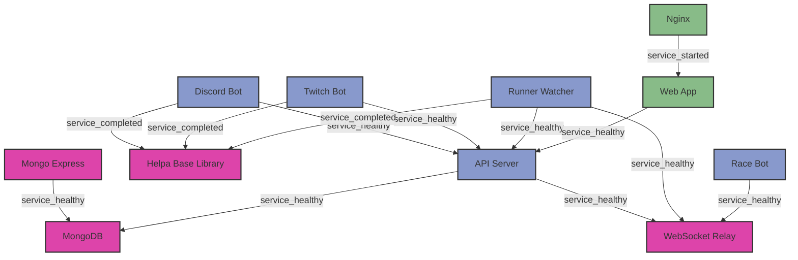

# CLAUDE.md

This file provides guidance to Claude Code (claude.ai/code) when working with code in this repository.

## Project Overview

Helpasaur King is a microservices-based application for the A Link to the Past (ALttP) speedrunning community, providing Discord/Twitch bot functionality, stream management, and race coordination.

## Core Services Architecture

- **API** (`/api/`): Express.js REST API with MongoDB, JWT auth, Socket.io, Twitch EventSub webhooks
- **Discord Bot** (`/discord/`): Discord.js v14 bot for commands, go-live notifications, race announcements
- **Twitch Bot** (`/twitch/`): tmi.js bot for Twitch chat commands
- **Web App** (`/web/`): React 18 + TypeScript frontend with Parcel, Bootstrap 5, TanStack Query
- **Race Bot** (`/racebot/`): TypeScript service for weekly racetime.gg race creation (Sundays 11:30 AM PT)
- **Runner Watcher** (`/runnerwatcher/`): Stream monitoring via Twitch EventSub
- **WebSocket Relay** (`/ws-relay/`): Socket.io hub for inter-service communication
- **Shared Library** (`/lib/helpa-api-client/`): Common Axios-based API client

## Essential Development Commands

**IMPORTANT: Always use these pnpm commands instead of direct docker/docker-compose commands**

```bash
# Development (from root)
pnpm start:dev          # Start all services with hot reload (uses docker-compose.dev.yml overlay)
pnpm start:dev:logs     # Start and follow logs
pnpm logs               # View service logs
pnpm boom:dev           # Full rebuild and restart for development
pnpm stop               # Stop all services

# Testing with ghcr.io images (from root)
pnpm pull:ghcr          # Pull images from GitHub Container Registry
pnpm start:ghcr         # Start using ghcr.io images (uses docker-compose.ghcr.yml overlay)
pnpm start:ghcr:logs    # Start with ghcr.io images and follow logs
VERSION=1.9.1 pnpm start:ghcr  # Start specific version from ghcr.io

# Production (from root)
pnpm start:prod         # Start production containers (uses docker-compose.prod.yml overlay)
pnpm build              # Build all Docker images
pnpm stop               # Stop all services

# Service-specific development (when working on individual services)
cd api && npm run dev                    # API with nodemon
cd discord && npm run dev                # Discord bot with nodemon  
cd twitch && npm run dev                 # Twitch bot with nodemon
cd web && npm run dev                    # React app with Parcel dev server
cd racebot && npm run dev                # Race bot with ts-node-dev
cd runnerwatcher && npm run dev          # Runner watcher with nodemon
```

## Service Dependency Graph



## Database & Infrastructure

- **MongoDB 7**: Main database, accessed via Mongoose ODM
- **Docker Compose**: Orchestrates all services with dev/prod configurations
- **Nginx**: Reverse proxy with SSL termination
- **Environment**: Services use `.env` files (not committed), see `.env.sample` files

## Key Development Patterns

### API Communication
- Services communicate via the shared `helpa-api-client` library
- WebSocket relay broadcasts real-time events between services
- API uses JWT tokens for authentication (Twitch OAuth integration)

### MongoDB Models (in `/api/models/`)
- `Command`: Bot commands for Discord/Twitch
- `Stream`: Twitch stream tracking
- `Configuration`: Service configuration storage
- `Race`: Weekly race information
- `User`: User authentication and preferences

### Frontend Routing (in `/web/src/`)
- `/commands`: Command directory
- `/streams`: ALttP stream directory  
- `/twitch`: Twitch bot management
- `/admin`: Admin panel (requires auth)

### Real-time Features
- Socket.io connections in API, web app, and ws-relay
- Twitch EventSub webhooks for stream events
- racetime.gg WebSocket for race room interaction

## Testing & Deployment

- No formal test suite - manual testing in dev environment
- GitHub Actions CI/CD pipeline deploys to DigitalOcean on main branch push
- Production URLs: helpasaur.com, api.helpasaur.com, rw.helpasaur.com

## Common Tasks

### Adding a new bot command
1. Create command in MongoDB via API or admin panel
2. Commands are fetched dynamically by Discord/Twitch bots
3. Use `type: 'basic'` for simple text responses

### Modifying stream detection
1. Runner watcher service handles Twitch EventSub webhooks
2. Stream alerts are managed in `/runnerwatcher/src/` 
3. ALttP game detection uses Twitch game ID filtering

### Working with weekly races
1. Race bot creates races Sunday 11:30 AM PT
2. Configuration in `/racebot/src/config.ts`
3. Race announcements go through Discord bot

### Frontend development
1. React components in `/web/src/components/`
2. API calls use TanStack Query hooks
3. Bootstrap theme customization in `/web/src/scss/`

## Environment Variables

Each service has a `.env.sample` file showing required variables. Key ones:
- `TWITCH_CLIENT_ID/SECRET`: Twitch app credentials
- `DISCORD_TOKEN`: Discord bot token
- `MONGODB_URI`: MongoDB connection string
- `JWT_SECRET`: API authentication secret
- `RACETIME_TOKEN`: racetime.gg API token