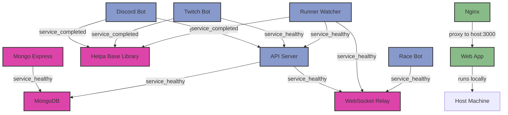

# CLAUDE.md

This file provides guidance to Claude Code (claude.ai/code) when working with code in this repository.

## Project Overview

Helpasaur King is a microservices-based application for the A Link to the Past (ALttP) speedrunning community, providing Discord/Twitch bot functionality, stream management, and race coordination.

## Core Services Architecture

- **API** (`/api/`): Express.js REST API with MongoDB, JWT auth, Socket.io, Twitch EventSub webhooks
- **Discord Bot** (`/discord/`): Discord.js v14 bot for commands, go-live notifications, race announcements
- **Twitch Bot** (`/twitch/`): tmi.js bot for Twitch chat commands
- **Web App** (`/web/`): React 18 + TypeScript frontend with Parcel, Bootstrap 5, TanStack Query (hosted on GitHub Pages)
- **Race Bot** (`/racebot/`): TypeScript service for weekly racetime.gg race creation (Sundays 11:30 AM PT)
- **Runner Watcher** (`/runnerwatcher/`): Stream monitoring via Twitch EventSub
- **WebSocket Relay** (`/ws-relay/`): Socket.io hub for inter-service communication
- **Shared Library** (`/lib/helpa-api-client/`): Common Axios-based API client
- **Monitoring** (`/monitoring/`): Uptime Kuma monitoring stack (separate from main application)

## Essential Development Commands

**IMPORTANT: Always use these pnpm commands instead of direct docker/docker-compose commands**

```bash
# Development (from root)
pnpm start              # Start backend services and show instructions for web
pnpm start:backend      # Start backend services in Docker (detached)
pnpm start:web          # Start web dev server (run in separate terminal)
pnpm stop               # Stop all Docker services
pnpm build              # Build all Docker images
pnpm logs               # View Docker service logs
pnpm boom               # Full rebuild and restart
pnpm version:bump       # Bump version in all package.json files

# Monitoring Stack Commands (local development only)
pnpm monitor:start      # Start Uptime Kuma monitoring locally
pnpm monitor:stop       # Stop monitoring
pnpm monitor:restart    # Restart monitoring
pnpm monitor:logs       # View monitoring logs
pnpm monitor:generate   # Generate monitoring configs from template
pnpm monitor:import     # Import configs to Uptime Kuma via API

# Service-specific development (when working on individual services)
cd api && npm run dev                    # API with nodemon
cd discord && npm run dev                # Discord bot with nodemon
cd twitch && npm run dev                 # Twitch bot with nodemon
cd web && npm run dev                    # React app with Parcel dev server
cd racebot && npm run dev                # Race bot with ts-node-dev
cd runnerwatcher && npm run dev          # Runner watcher with nodemon
```

**Note**: Web app runs locally on your host machine (not in Docker). Start backend with `pnpm start:backend`, then run `pnpm start:web` in a separate terminal for the web dev server on port 3000.

## Production Scripts

Located in `/scripts/` directory (deployed to production server):

```bash
# Deployment and maintenance (run on production server only)
bash ./scripts/deploy.sh [VERSION]       # Deploy specific version (default: latest)
bash ./scripts/cleanup.sh [KEEP_COUNT]   # Clean old Docker images (default: keep 3)
bash ./scripts/mongo-backup.sh           # Create MongoDB backup
bash ./scripts/renew-certs.sh            # Renew SSL certificates
```

## Service Dependency Graph



## Database & Infrastructure

- **MongoDB 7**: Main database, accessed via Mongoose ODM
- **Docker Compose**: Orchestrates all services with dev/prod configurations
  - Main stack: `docker-compose.yml` for application services
  - Monitoring stack: `docker-compose.monitoring.yml` for Uptime Kuma (local development only)
- **Nginx**: Reverse proxy for API/services (production), proxies to local web dev server (development)
- **Uptime Kuma**: Service monitoring dashboard (local only, port 3333) - monitors production services externally
- **Environment**: Services use `.env` files (not committed), see `.env.sample` files

## Key Development Patterns

### API Communication

- Services communicate via the shared `helpa-api-client` library
- WebSocket relay broadcasts real-time events between services
- API uses JWT tokens for authentication (Twitch OAuth integration)

### MongoDB Models (in `/api/models/`)

- `Command`: Bot commands for Discord/Twitch
- `Stream`: Twitch stream tracking
- `Configuration`: Service configuration storage
- `Race`: Weekly race information
- `User`: User authentication and preferences

### Frontend Routing (in `/web/src/`)

- `/commands`: Command directory
- `/streams`: ALttP stream directory
- `/twitch`: Twitch bot management
- `/admin`: Admin panel (requires auth)

### Real-time Features

- Socket.io connections in API, web app, and ws-relay
- Twitch EventSub webhooks for stream events
- racetime.gg WebSocket for race room interaction

## Testing & Deployment

- No formal test suite - manual testing in dev environment
- GitHub Actions CI/CD pipeline:
  - Builds and pushes images to ghcr.io on release
  - Manual deployment trigger via workflow_dispatch
- Production URLs: helpasaur.com (GitHub Pages), api.helpasaur.com, rw.helpasaur.com

## Common Tasks

### Adding a new bot command

1. Create command in MongoDB via API or admin panel
2. Commands are fetched dynamically by Discord/Twitch bots
3. Use `type: 'basic'` for simple text responses

### Modifying stream detection

1. Runner watcher service handles Twitch EventSub webhooks
2. Stream alerts are managed in `/runnerwatcher/src/`
3. ALttP game detection uses Twitch game ID filtering

### Working with weekly races

1. Race bot creates races Sunday 11:30 AM PT
2. Configuration in `/racebot/src/config.ts`
3. Race announcements go through Discord bot

### Frontend development

1. React components in `/web/src/components/`
2. API calls use TanStack Query hooks
3. Bootstrap theme customization in `/web/src/scss/`
4. Run locally with `pnpm start:web` (not in Docker)
5. Deployed to GitHub Pages on production

### Setting up monitoring (local only)

1. Start monitoring stack locally: `pnpm monitor:start`
2. Access Uptime Kuma at http://localhost:3333
3. Generate configs: `pnpm monitor:generate`
4. Import configs via API: `pnpm monitor:import app-services.dev.json` or `app-services.prod.json`
5. Monitoring runs locally, separate from production deployment
6. Production monitoring uses external URLs to monitor services remotely

## Environment Variables

Each service has a `.env.sample` file showing required variables. Key ones:

- `TWITCH_CLIENT_ID/SECRET`: Twitch app credentials
- `DISCORD_TOKEN`: Discord bot token
- `MONGODB_URI`: MongoDB connection string
- `JWT_SECRET`: API authentication secret
- `RACETIME_TOKEN`: racetime.gg API token
- `API_HOST`: API URL for web app (required at build time)
- `TWITCH_APP_CLIENT_ID`: Twitch client ID for web app (required at build time)
- Update @CLAUDE.md anytime modifications are made to the package.json scripts.
